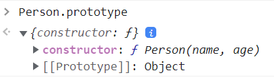

# 原型和原型链

## 构造函数

构造函数和普通函数本质上没什么区别，只不过使用了 <code>new</code> 关键字创建对象的函数，被叫做了构造函数。构造函数的首字母一般是大写，用以区分普通函数，当然不大写也不会有什么错误。
```javascript
function Person(name, age) {
  this.name = name;
  this.age = age;
  this.species = '人类';
  this.say = function () {
    console.log('你好');
  }
}

let person1 = new Person('mj921', 20);
```

## 原型对象

在js中，每一个函数类型的数据，都有一个叫做 <code>prototype</code> 的属性，这个属性指向的是一个对象，就是所谓的原型对象。



对于原型对象来说，它有一个 <code>constructor</code> 属性，指向的是他的构造函数
```javascript
console.log(Person === Person.prototype.constructor); // true
```
原型对象主要的作用就是用来存放实例对象的公有属性和公有方法。
<code>Person</code> 中的 <code>species</code> 和 <code>say</code> 所有的实例对象都一样，如果放在构造函数中每次实例化都会复制一份，消耗内存更高，我们可以把它们放到原型中。

```javascript
function Person(name, age) {
  this.name = name;
  this.age = age;
}

Person.prototype.species = '人类';
Person.prototype.say = function () {
  console.log('你好');
}

let person1 = new Person('mj921', 20);
let person2 = new Person('mjmj921', 18);

console.log(person1.species); // 人类
console.log(person2.species); // 人类

person1.say(); // 你好
person2.say(); // 你好
```

在实例对象修改原型上的属性：如果改的是基本数据类型，修改时会直接在实例上创建该属性，而不会在原型上修改；而引用类型，如果改的是整个属性，也会直接在实例上创建该属性，如果改的是属性里的子属性，则是会改变原型上的属性。

```javascript
function Person() {}
Person.prototype.age = 18;
Person.prototype.name = { firstName: 'm', lastName: 'j' };
Person.prototype.address = { province: '浙江', city: '杭州' };

const person1 = new Person();
const person2 = new Person();

person1.age = 20;
console.log(person1.age); // 20
console.log(person2.age); // 18
console.log(Person.prototype.age); // 18

person1.name = { f: 'f', l: 'l' };
console.log(person1.name); // { f: 'f', l: 'l' }
console.log(person2.name); // { firstName: 'm', lastName: 'j' }
console.log(Person.prototype.name); // { firstName: 'm', lastName: 'j' }

person1.address.city = '绍兴';
console.log(person1.address); // { province: '浙江', city: '绍兴' }
console.log(person2.address); // { province: '浙江', city: '绍兴' }
console.log(Person.prototype.address); // { province: '浙江', city: '绍兴' }
```

## 显示原型和隐式原型

每个函数 <code>Function</code> 都有一个 <code>prototype</code> 称为显式原型。

每个实例对象都有一个 <code>\_\_proto\_\_</code> 称为隐式原型。

::: tip 注意
通过 <code>Function.prototype.bind</code> 方法构造出来的函数没有 <code>prototype</code> 属性。

<code>Object.prototype</code> 这个对象的是个例外，它的 <code>\_\_proto\_\_</code> 值为 <code>null</code> 。

<code>Function</code> 的 <code>\_\_proto\_\_</code> 指向其构造函数 <code>Function</code> 的 <code>prototype</code> 。

```javascript
console.log(Function.__proto__ === Function.prototype); // true
```
:::

### 两者关系

对象的隐式原型指向创建该对象的函数的显式原型

1. 通过 <code>new</code> 方式创建的对象，它的隐式原型指向构造函数的 <code>prototype</code> 。

```javascript
function Person() {}
const person = new Person();
console.log(person.__proto__ === Person.prototype); // true
```
2. 通过对象字面量的方式创建的对象，它的隐式原型指向 <code>Object.prototype</code> 。

```javascript
const person = {};
console.log(person.__proto__ === Object.prototype); // true
```
3. 通过 <code>Object.create</code> 创建的对象，它的隐式原型指向的是 <code>create</code> 的参数。

```javascript
const obj = {};
const person = Object.create(obj);
console.log(person.__proto__ === obj); // true
```


## 原型链

对象访问属性或方法时，如果找不到在对象上找不到，就会在他构造函数的原型对象上（即对象的隐型原型 <code>\_\_proto\_\_</code> ）查找，如果没有就会在原型的原型上查找，以此类推直到找到原型链的终点 <code>null</code> ,如果还没有找到是属性就返回 <code>undefined</code> ，如果是方法就返回 <code>xxx is not a function</code> 。

原型链又叫隐式原型链，是由 <code>\_\_proto\_\_</code> 属性串联起来，原型链的尽头是 <code>Object.prototype</code> 。

